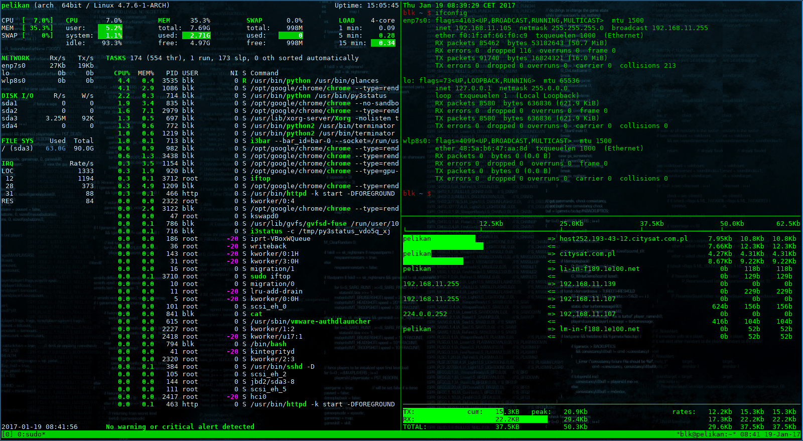

Terminsal utilities
=======================

 
tmux
------  

.. index:: tmux

https://github.com/tmux/tmux/wiki

Trzyma kilka sesji terminalu w jednej, możliwość opuszczenia okna( włączenie jego dalszej pracy w tle) i ponowne przyłączenie.

ttyrec
-------

.. index:: ttyrec

https://github.com/mjording/ttyrec

Nagrywanie, odtwarzania sesji terminalowej i konwersja sesji do formatu gif.

