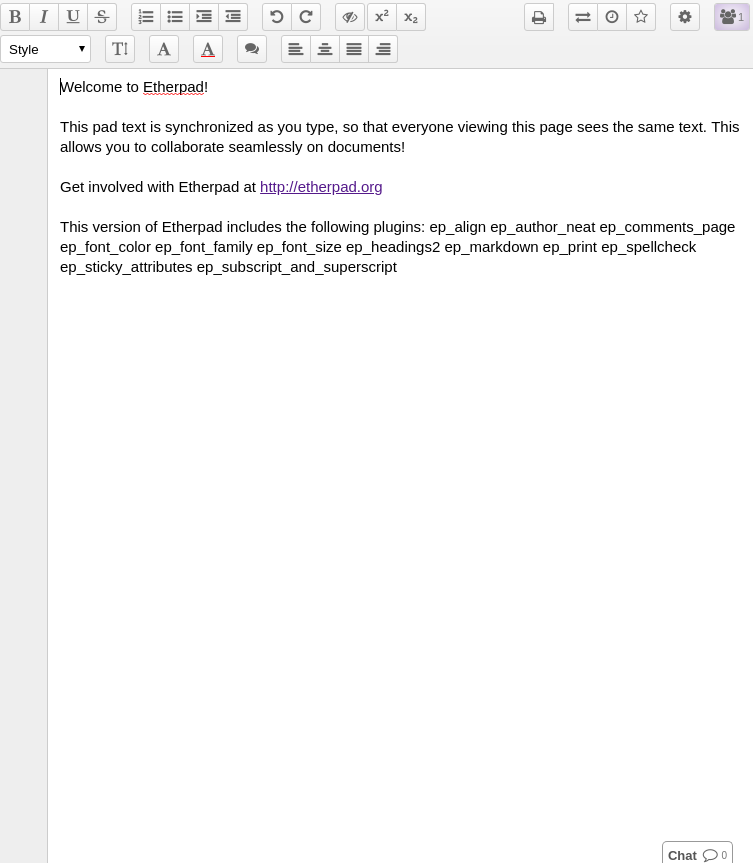
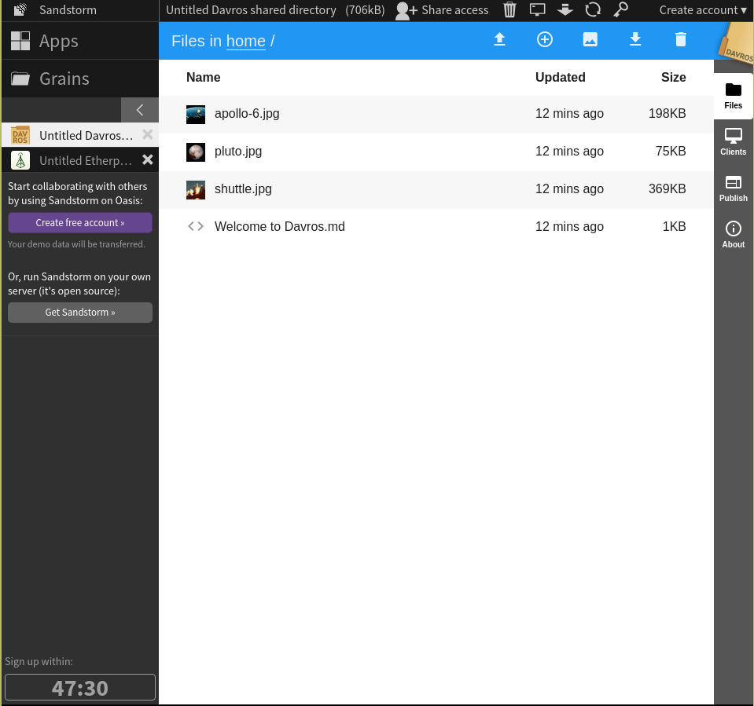

Notes w przegladarce
=================================

.._: http://etherpad.org

etherpad_
---------------
Prosty notes w przegladarce, aplikacja napisana w javascript, opensource i self-hosted. Wspiera wersjonowanie per uztkownika i chat dla danego pliku.

.. index:: etherpad

.._: https://sandstorm.io

sandstorm_
---------------
Kontener dla aplikacji napisanych javascipt. Grupuje i umożlwia integracje kilku popularnych aplikacji w jedna strukturę/miejsce np Etherpad ( notes ) z Davros ( menadżer plikow ).
Web aplikacja, opensource i self-hosted,  napisany w Metorze, duża ilosc integracji. 

.. index:: sandstorm
